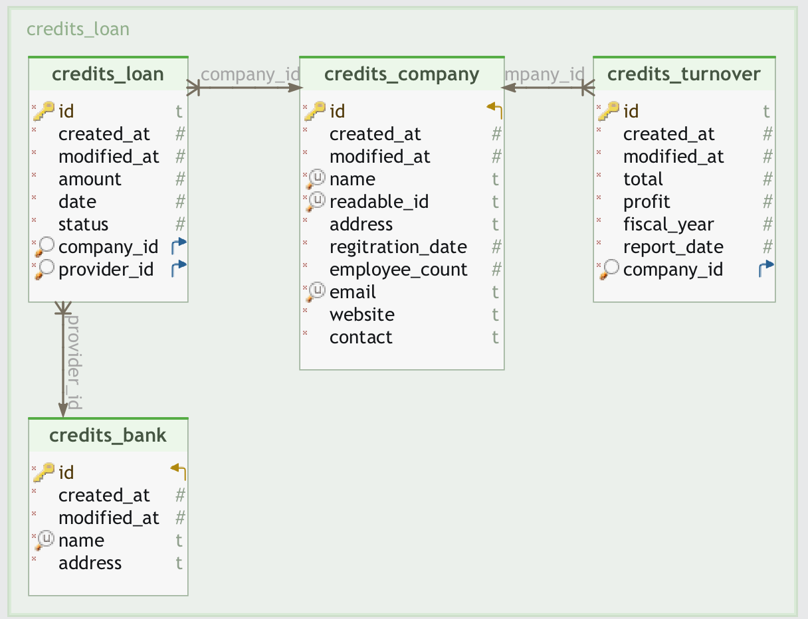

# Credit Information

## Table of Contents

* [Getting Started](#getting-started)
* [Using Docker](#using-docker)
* [Access Application](#access-your-application)
* [Generate Token](#generate-token)
* [Swagger API Docs](#swagger-api-docs)

## Getting Started
```
Developed RESTful APIs that provides credit information data to a front-end dashboard. The
API will handle requests to retrieve and manipulate credit information which is computed as
just a difference of annual turnover for last 2 years and due loans.
```

### Using Docker

- Clone the repo

```
git clone https://github.com/sushilchand/credhive.git
```

- Bring up the app

```
docker-compose up -d --build
```

- Perform the migration

```
# Run migrations
docker-compose run web python manage.py migrate

# Create a superuser
docker-compose run web python manage.py createsuperuser

# Generate Dummy data
docker-compose run web python manage.py generate_dummy_data

```
## Postgresql DB Schema




## Access your Application

```
Django Application: Open http://localhost:8000/admin/ in your browser.
PostgreSQL: Connect to PostgreSQL using localhost:5432, with the username, password, and database name you configured.
```

## Generate Token
```
Token Generation
curl --location 'http://localhost:8000/api/token/' --header 'Content-Type: application/x-www-form-urlencoded' --data-urlencode 'username=root' --data-urlencode 'password=root'

Then use the access token as Authorization token with each API
example curl for list companies
curl --location 'http://localhost:8000/api/v1/company/' --header 'Authorization: Bearer <token>'
```

## Swagger API docs
```
To access API docs, access http://localhost:8000/swagger/
It contains all the available API document which can be used to understand the request and response structure
```